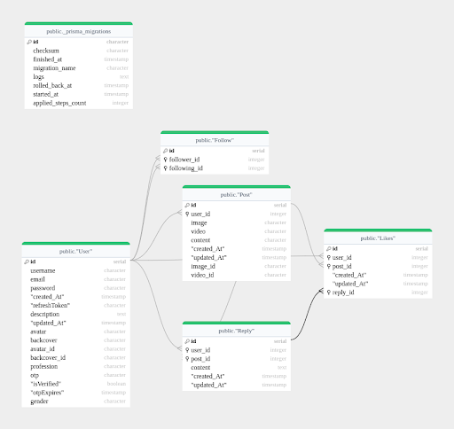

PJTweets is a robust social media web application designed for users to create accounts, log in, post tweets, view and interact with tweets, follow other users, and manage their profiles.
Built using a modern tech stack, including React, Tailwind CSS, Redux, Node.js, Express, Prisma, and PostgreSQL

ER Diagram : 

Deploy link :

[PJ-Tweets](https://finalyear-snowy.vercel.app/)

Current Progress : 
Working on docker for deployment
backend image : ''' docker pull pmjadhav/social:1.0 '''
